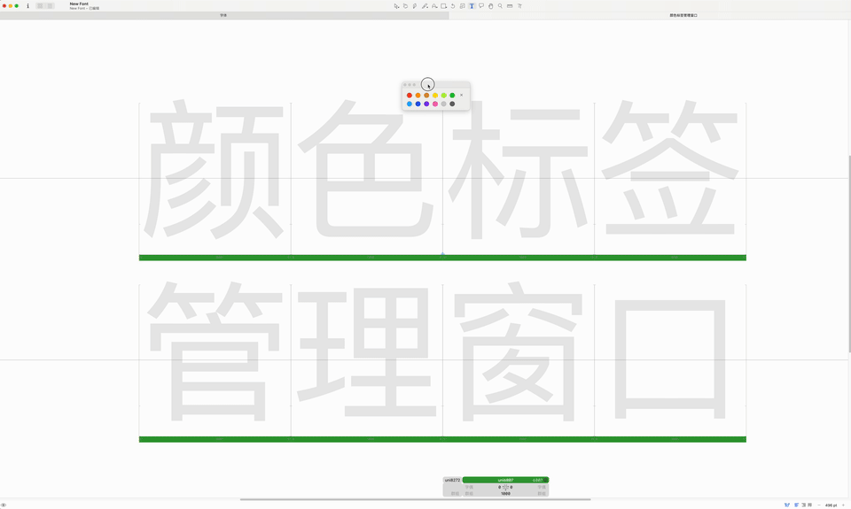

# Glyphs Color Labels（颜色标签窗口）

一个用于 Glyphs 3 的轻量级悬浮颜色标签面板。

[English README](./README.md)

## 预览

## 下载

从本仓库下载 `Color Label Manager.py`。

使用 Glyphs Color Labels 只需要这个脚本文件。

## 功能

- 悬浮颜色标签面板
- 快速为字形应用颜色标签
- 支持批量为选中的字形设置颜色标签
- 按住 `Option` 可将颜色标签应用到选中的图层
- 点击 `×` 可清除颜色标签
- 简洁轻量，无需安装为 Glyphs 插件

## 安装方式

1. 打开 Glyphs。

2. 在顶部菜单栏中选择：

   `脚本 ➜ 打开脚本文件夹 ➜ 显示 Glyphs 文件夹`

3. 将 `Color Label Manager.py` 放入：

   `Glyphs 文件夹 ➜ Scripts`

4. 关闭并重新启动 Glyphs。

5. 再次打开 Glyphs，在顶部菜单栏中选择：

   `脚本 ➜ Color Label Manager`

## 使用方法

1. 在 Glyphs 中选中一个或多个字形或图层。
2. 运行 `脚本 ➜ Color Label Manager`。
3. 点击颜色圆点，为选中内容应用对应的颜色标签。
4. 点击 `×` 可清除颜色标签。
5. 按住 `Option` 并点击颜色圆点，可将颜色标签应用到选中的图层，而不是字形。

## 行为说明

默认情况下，脚本会将选中的颜色标签应用到当前选中的字形。

当选中多个字形时，颜色标签会批量应用到所有选中字形。

按住 `Option` 时，颜色标签会应用到选中的图层，而不是字形本身。

## 运行环境

- Glyphs 3
- macOS
- Glyphs 自带 Python 环境，并支持 `vanilla`

## 常见问题

### 脚本没有出现在“脚本”菜单中

请确认 `Color Label Manager.py` 已直接放入 Glyphs 的 `Scripts` 文件夹中，然后重新启动 Glyphs。

### 点击颜色没有反应

请确认当前已经打开字体文件，并且至少选中了一个字形或图层。

### 如何清除颜色标签？

点击悬浮窗口中的 `×` 按钮即可清除颜色标签。

### 窗口已经打开时会怎样？

再次运行脚本时，会关闭旧的悬浮窗口，并打开一个新的窗口。

## 说明

这是一个 Glyphs 脚本，不是 Glyphs 插件。

它不会修改字形轮廓，不会创建新的颜色标签定义，也不会改变除选中字形或图层颜色标签之外的字体数据。

## 许可证

MIT License
